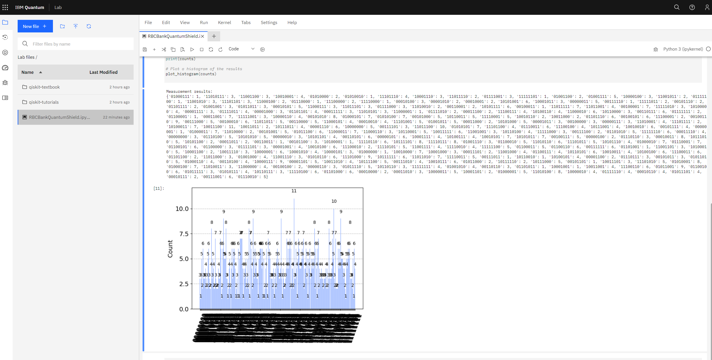

# RBC Bank QuantumShield - Lattice-based Cryptography for Quantum Computing Cybersecurity
RBC Bank QuantumShield is a project aimed at enhancing cybersecurity in the era of quantum computing by leveraging lattice-based cryptography. Quantum computing poses a significant threat to traditional cryptographic systems, and RBC Bank QuantumShield addresses this concern by employing lattice-based cryptography. By utilizing the principles of quantum computing and lattice-based encryption schemes, RBC Bank QuantumShield enhances the security of data transmission, encryption, and authentication processes.

## Result 



The measurement results obtained from running the RBC Bank QuantumShield encryption circuit provide information about the outcomes of the quantum computations. Each entry in the dictionary represents a measurement result, where the key is the binary string representing the measured state, and the value is the frequency of that particular outcome.

Here's an explanation of the measurement results:

```
Measurement results:
{'01000111': 1, '11010111': 3, '11001100': 3, '10010001': 4, '01010000': 2, '01010010': 1, '11101110': 4, '10001110': 3, '11011110': 2, '01111001': 3, '11111101': 1, '01001100': 2, '01001111': 5, '10000100': 3, '11001011': 2, '01111100': 1, '11001010': 3, '11101101': 3, '11000100': 2, '01110000': 1, '11100000': 2, '11110000': 1, '00010100': 3, '00001010': 2, '00010001': 2, '10101001': 6, '10001011': 3, '00000011': 5, '00111110': 1, '11111011': 2, '00101110': 2, '01101111': 2, '01001001': 3, '01011011': 3, '00010101': 5, '11000111': 3, '11011101': 3, '01111000': 3, '11010010': 2, '00110001': 2, '10101111': 6, '00100011': 1, '11011111': 7, '11011001': 4, '00100001': 7, '11111010': 3, '10100000': 4, '00001111': 3, '01111011': 4, '00001000': 3, '01101101': 4, '00011111': 3, '11010101': 3, '11000001': 1, '01111010': 2, '00011100': 2, '11100111': 4, '10100110': 4, '11000010': 6, '10110000': 3, '00110111': 6, '01111111': 2, '01100001': 1, '00011001': 7, '11111001': 3, '10000110': 4, '00101010': 8, '01000101': 7, '01010100': 7, '00101000': 5, '10110011': 5, '11110001': 5, '10010110': 2, '10011000': 2, '01101110': 6, '00100101': 6, '11100001': 2, '00100110': 9, '00111000': 5, '00100010': 6, '11011011': 5, '00110000': 5, '11000101': 4, '00010010': 4, '11101001': 5, '01001011': 5, '00011000': 2, '10101000': 5, '00001011': 3, '00100000': 3, '00000111': 3, '11010001': 4, '11101111': 2, '10100011': 7, '10011100': 11, '10011011': 2, '10111011': 4, '00001110': 6, '10000000': 5, '00111101': 3, '11011100': 10, '01010101': 7, '11101100': 4, '01110011': 6, '11100100': 4, '10111001': 4, '10010010': 6, '00101111': 4, '00000001': 1, '01000011': 7, '11010000': 2, '00101001': 5, '01011100': 6, '11000011': 7, '11000110': 3, '10110001': 5, '10011111': 6, '11001001': 3, '10110100': 4, '11111000': 3, '00111100': 2, '01101010': 5, '11111110': 6, '00011110': 4, '00000000': 3, '01110100': 5, '10101010': 5, '00000010': 3, '10101101': 4, '00110101': 6, '00000101': 6, '10001111': 4, '10100111': 4, '10010101': 7, '10101011': 7, '00100111': 5, '00000100': 2, '01110110': 3, '00010011': 8, '10111010': 5, '10101100': 2, '00011011': 2, '00110011': 1, '00101100': 3, '10100001': 1, '11110110': 6, '10111101': 8, '11110111': 8, '01001110': 3, '01100010': 5, '11010110': 6, '11101011': 5, '10101110': 4, '01000010': 7, '01110001': 7, '01100101': 6, '01100000': 3, '01111101': 3, '00001001': 4, '10010100': 6, '11100010': 2, '11110101': 5, '11001111': 4, '11110010': 4, '11111100': 5, '01100011': 5, '01100110': 6, '00111111': 6, '01101001': 1, '11001101': 3, '10100010': 5, '10001100': 2, '10011110': 3, '10000001': 6, '10001010': 4, '10000101': 3, '01000000': 1, '10010000': 7, '10001000': 3, '00011101': 2, '11001000': 4, '01100111': 4, '10110101': 6, '10010011': 4, '10100100': 6, '11100011': 6, '01101100': 2, '11011000': 3, '01001000': 4, '11001110': 3, '01010110': 6, '11101000': 9, '10111111': 6, '11011010': 7, '11110011': 5, '00111011': 1, '10110010': 1, '10100101': 4, '00001100': 2, '01110111': 3, '00101011': 3, '01011010': 5, '01000110': 4, '00110100': 4, '10000111': 9, '00001101': 5, '10011010': 4, '10111100': 5, '00111010': 4, '10010111': 6, '01011000': 2, '10111110': 2, '10111000': 5, '00101101': 1, '10011101': 3, '11101010': 5, '01010001': 8, '01000100': 7, '11010011': 3, '11000000': 4, '00100100': 2, '00000110': 3, '01011110': 5, '10110110': 3, '11111111': 4, '01001010': 4, '00110110': 3, '01101011': 1, '10001001': 1, '10011001': 4, '11100110': 6, '01011001': 9, '01100100': 6, '01011111': 3, '01010111': 4, '10110111': 3, '11110100': 6, '01101000': 6, '00010000': 2, '00011010': 3, '10000011': 5, '10001101': 2, '01000001': 5, '11010100': 8, '10000010': 4, '01111110': 4, '00010110': 4, '01011101': 4, '00010111': 2, '00111001': 6, '01110010': 5}

```

```
'01000111': 1
'11010111': 3
'11001100': 3
'10010001': 4
'01010000': 2
'01010010': 1
'11101110': 4
'10001110': 3
'11011110': 2
'01111001': 3
```

These results represent specific measurement outcomes and their corresponding frequencies. For example, '01000111' was observed once, '11010111' was observed three times, and so on.

The measurement outcomes are binary strings, where each digit corresponds to the measurement result of a single qubit. The results provide insights into the distribution and frequencies of different states measured in the circuit.

The measurement results can be used to analyze the effectiveness of the lattice-based cryptography circuit. By examining the frequencies of different outcomes, it is possible to assess the quality of encryption, randomness, and security of the implemented scheme. Deviations from an expected distribution or biases in the results could indicate potential vulnerabilities or issues in the encryption process.

Further analysis and evaluation of the measurement results, along with additional testing and verification, are typically required to draw definitive conclusions about the performance and security of the encryption scheme implemented in the RBC Bank QuantumShield project.


## Security Considerations
RBC Bank QuantumShield is designed to enhance cybersecurity and protect sensitive data in the era of quantum computing. It employs lattice-based cryptography, which is currently considered a promising approach for post-quantum security. However, it's important to regularly review and update the cryptographic algorithms and protocols as advancements in quantum computing progress. Additionally, secure key management and distribution processes are crucial to maintain the security of the encrypted data.


